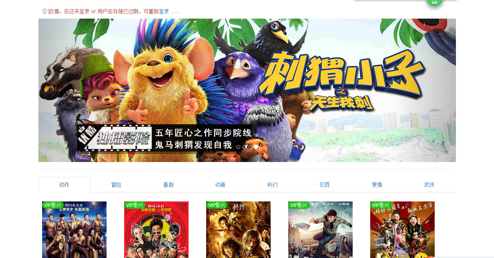
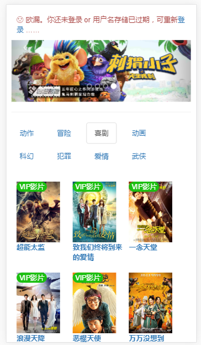

## 网站相关技术：

django 框架搭建整个网站

bootstrap 作为前端样式框架

使用微信 JS-SDK 开发工具包，对接微信分享API,使之视频播放页面支持微信分享

python 用于程序后台逻辑处理

使用 django 自带的数据库 Sqlite3 存储网站数据

> Admin（后台管理）:

用户名：root      密码：root


## 项目环境相关依赖：

Django 安装：
```bash
> $ pip install Django==1.8.13

```

Django REST framework 安装：
```bash
> $ pip install djangorestframework

```

Django REST Swagger 安装：
```bash
> $ pip install django-rest-swagger

```

Requests 安装：
```bash
> $ pip install requests

```

## 项目运行：

```bash
> $ python manage.py runserver 端口

```


## 项目展示：
__[视频网站（部分内容）](http://oojestrjh.bkt.clouddn.com/movieweb/index.html)__

> PC 端

 __首页:__



 __播放页面:__


> 移动端



© Movie website. Developer by [hanyu](https://github.com/hanyucd).
