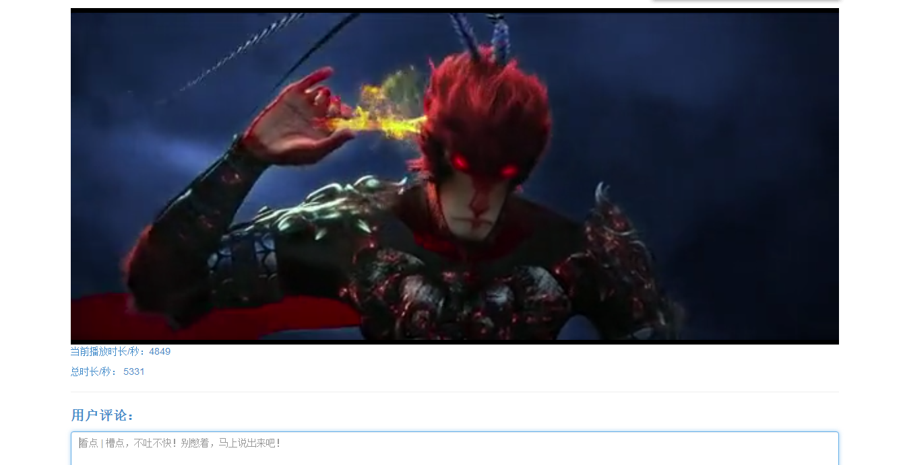

## 网站相关技术：

django框架搭建整个网站

bootstrap作为前端样式框架

使用微信JS-SDK开发工具包，对接微信分享API,使之视频播放页面支持微信分享

python用于程序后台逻辑处理

使用django自带的数据库Sqlite3存储网站数据

> Admin（后台管理）:

用户名：root      密码：root

--------------------------
## 网站展示：
__[视频网站（部分内容）](http://oojestrjh.bkt.clouddn.com/movieweb/index.html)__

* __首页:__

* __播放页面:__

